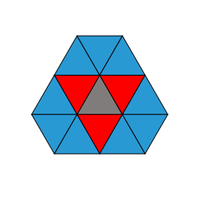

# processing-spheric-cellular-automaton

## dependencies

- [Processing](https://processing.org/)
- [ControlP5](https://www.sojamo.de/libraries/controlP5/)
- [Peasycam](https://mrfeinberg.com/peasycam/)

## fonctionnement

### Création de la sphère

On construit d'abord un octaèdre.

On divise les faces triangulaires en quatre triangles.

On projette les points sur une sphère par normalisation des vecteurs.

### Première itération et recherche des voisins

À la première boucle, chaque triangle recherche ses voisins proches et ses voisins éloignés et garde des références pour les prochaines itérations

- rouges proches
- bleus éloignés

### Algorithmes cellulaires

4 algorithmes sont disponibles, inspirés d'algorithme connu

Islands
[Seeds](https://en.wikipedia.org/wiki/Seeds_(cellular_automaton))
[Brian's](https://en.wikipedia.org/wiki/Brian%27s_Brain)
[game of life](https://en.wikipedia.org/wiki/Conway%27s_Game_of_Life)

le depart se fait soit par une unique cellule allumé ou un tirage au sort de l'état des cellules
